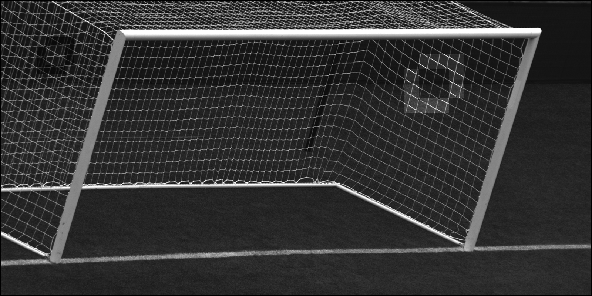
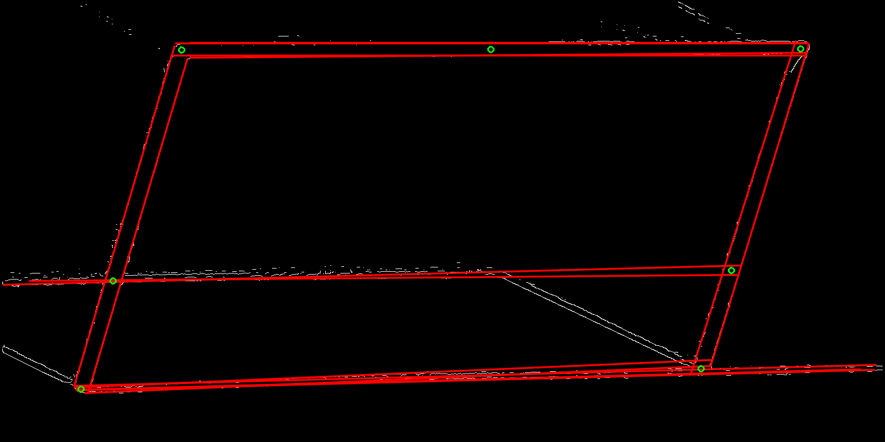

# Goal-Post-Detection
Detecting goalpost in image

## Requirements to run
Visual Studio with OpenCV setup.

## Example Test
Green circles are the detected points in the second image below.
Red lines are the hough lines.
White lines represent the segmented image over which hough transform was applied.

### Captured Image

### Detected goalpost

